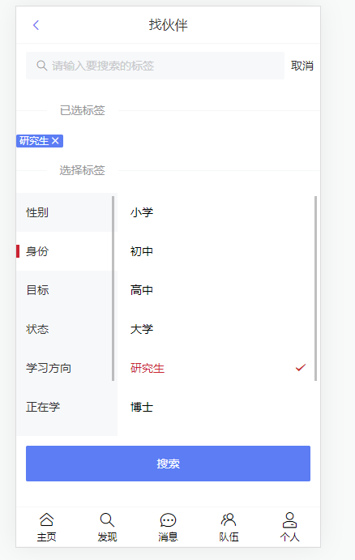

# 寻找伙伴

# friendFinder - 寻找志趣相投的伙伴

> 由程序员鱼皮的伙伴匹配系统为基础，在此基础上扩展了一些内容

## friendFinder 是什么？

> 一个帮助大家找寻志同道合的伙伴的移动端网站（APP 风格），包括主页、发现、消息、队伍、个人五大模块。

主页：


找伙伴：



发送消息：


搜寻队伍：


个人信息修改：


具体功能如下：

1. 主页包含普通模式(直接分页返回用户)和心动模式(根据标签推荐相似用户)。

2. 发现页可以按着分类标签搜索用户。

3. 消息页由通知内容(刷新其他用户发来的消息)和消息内容(可以给其他用户发送消息)。

4. 队伍页可以按照公开，私有，加密三种方式展示队伍信息，同时支持根据标签过滤队伍。

5. 个人页支持用户信息修改，创建及加入队伍信息的查询，以及用户切换和退出功能。

## 技术栈

### 前端

- Vue 3
- Vant UI 组件库(有赞移动端组件库)
- Vite 脚手架
- Axios 请求库
- TypeScript 类型控制

### 后端

- SpringBoot 2.7.x 框架
- MySQL
- MyBatis-Plus/MyBatis X 自动生成
- Redis 缓存（Spring Data Redis 等多种实现方式）
- Redisson 分布式锁
- Easy Excel 数据导入
- Spring Scheduler 定时任务
- Swagger + Knife4j 接口文档
- Gson(JSON 序列化库)
- 相似度匹配算法

### 部署

- docker容器

## 快速上手

### 本地调试，前后端

1. 利用WenStorm打开前端项目

```
# 进入指定路径
cd ./frontend
# 安装依赖
yarn install 或 npm -i
# dev方式在本地运行
点击dev
```

2. 利用Idea 打开后端项目

```
点击DeBug方式运行即可
```

### 部署前后端

1. frontend路径下，执行 vite build 生成dist 放在服务器上nginx路径下即可

2. backend路径下，maven install, 生成jar包运行

3. 依赖服务，需要单独启动

- MySQL服务
- Redis服务

## 项目优势

### 用户

- 帮助用户搜索伙伴，找到志趣相投的伙伴
- 支持按分类标签和过滤条件组合搜索
- 提供普通模式和心动模式的搜索方式，可以方便找到兴趣相同的伙伴
- 支持创建公开、私有、加密等各种类型的队伍，适用于各种场景
- 支持简单地消息传递，以通知栏的形式滚动显示

### 学习者

- 学习APP型前端界面的搭建
- 学习前后端接口交互
- 巩固所学的框架(Vue,SpringBoot,Redis,JDBC)

## 系统设计

### 设计理念

1. 前端：组件复用、api接口统一封装、系统常量封装、pages页目录根据模块分层
2. 后端：
  1. 熟悉 SpringBoot 框架
  2. 利用SpringMVC + MyBatis + MyBatis Plus（提高开发效率）
  3. MySQL 数据库，库表设计
  4. Redis 缓存，实现分布式登录和分布式锁等功能
  5. 利用 Swagger + Knife4j 接口文档，方便接口调试
  6. 利用Easy Excel 进行数据导入，采用Spring Scheduler 定时任务来预热数据

### 核心


