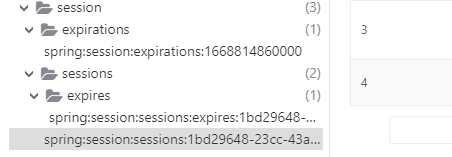
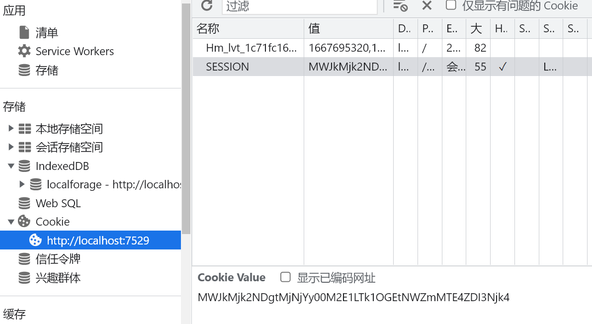

# 寻找伙伴文档
 
> 一个帮助大家找寻志同道合的伙伴的移动端网站（APP 风格）
 
# 1. 需求分析及功能介绍

## 1.1 需求分析

1. 用户可以添加标签
    * 标签的分类
        * 学习方向: 前端/后端/运维/大数据分析
        * 状态: 小学/初中/高中/大学/研究生/已毕业
2. 主动搜索：允许用户根据标签去搜索其他用户
   * 利用 Redis 缓存预热部分数据，便于用户快速搜索结果
3. 组队
   * 创建队伍
   * 加入队伍
   * 根据标签查询队伍
   * 邀请其他人加入队伍
4. 允许用户去修改标签
5. 推荐
   * 相似度计算算法 + 本地分布式计算

## 1.2 功能介绍

- 主页
    - 支持匹配人数选择
    - 普通模式(直接分页返回用户)和心动模式(根据标签推荐相似用户)
- 发现 
    - 标签分类: 性别、身份、目标、状态、学习方向、正在学、编程语言、工作内容
    - 支持根据**已有标签和输入的过滤条件**搜索用户
- 消息
    - 通知消息 —— 滚动显示其他用户传递的消息
    - 发送消息 —— 支持联系指定用户发送消息
- 队伍
    - 支持按照公开、私有、加密三种方式搜索队伍
    - 支持按照队伍名称和简介搜索队伍
- 个人
    - 显示当前用户信息
    - 支持用户信息修改
    - 管理创建的队伍
    - 显示加入的队伍
    - 设置信息，包含切换用户和退出

# 2. 技术选型/技术栈
 
## 2.1 前端
 
1. Vue 3 开发框架（提高页面开发的效率）
2. Vant UI（基于 Vue 的移动端组件库）（React 版 Zent）
3. Vite 2（打包工具，快！）
4. Nginx 来单机部署
 
## 2.2 后端
 
1. Java 编程语言 + SpringBoot 框架
2. SpringMVC + MyBatis + MyBatis Plus（提高开发效率）
3. MySQL 数据库
4. Redis 缓存
5. Swagger + Knife4j 接口文档
 
## 2.3 库表设计

**用户表 user**

- id（主键）bigint
- username 昵称  varchar
- userAccount 登录账号 
- avatarUrl 头像 varchar
- gender 性别 tinyint
- userPassword 密码  varchar
- phone 电话 varchar
- email 邮箱 varchar
- userStatus 用户状态 int  0 - 正常 
- createTime 创建时间（数据插入时间）datetime
- updateTime 更新时间（数据更新时间）datetime
- isDelete 是否删除 0 1（逻辑删除）tinyint
- userRole 用户角色 0 - 普通用户 1 - 管理员
- planetCode 星球编号 varchar
- tags 标签列表 varchar
- profile 个人简介 varchar

**队伍表 team**
 
字段：
 
- id 主键 bigint（最简单、连续，放 url 上比较简短，但缺点是爬虫）
- name 队伍名称
- description 描述
- maxNum 最大人数
- expireTime 过期时间
- userId 创建人 id
- status 0 - 公开，1 - 私有，2 - 加密
- password 密码
- createTime 创建时间
- updateTime 更新时间
- isDelete 是否删除
 
**用户 - 队伍表 user_team**
 
字段：
 
- id 主键
- userId 用户 id
- teamId 队伍 id
- joinTime 加入时间
- createTime 创建时间
- updateTime 更新时间
- isDelete 是否删除

**消息表 msg**
 
字段：
 
- id 主键
- sendId 发送方Id 
- targetId 目标Id 
- content 消息内容
- createTime 创建时间
- updateTime 更新时间
- isDelete 是否删除

# 4. 前端开发

## 4.1 项目初始化 

- 用脚手架初始化项目
    - [Vue CLI](https://cli.vuejs.org/zh/)
    - [**Vite 脚手架**](https://vitejs.cn/guide/#scaffolding-your-first-vite-project)
- 整合组件库 Vant： 
    - 安装 Vant(按需引入 npm i vite-plugin-style-import@1.4.1 -D)

## 4.2 整合路由
 
- Vue-Router：https://router.vuejs.org/zh/guide/#html，直接看官方文档引入

## 4.3 代码路径规划

针对代码中比较关键的路径做出介绍：

```
.
|-- api         ———— 调用接口统一
|-- components  ———— 组件复用
|-- config      ———— 路径配置文件
|-- constants   ———— 系统常量
|-- layouts     ———— 布局复用
|-- model       ———— 模型
|-- pages       ———— 各个模块页面
|-- plugins     ———— axios插件封装
|-- services    ———— 服务代码
`-- states      ———— 状态信息
```

## 4.4 逻辑实现

- 主页
    - 支持匹配人数选择，以及模式选择(普通和心动)
- 发现 
    - 标签内容编写
    - 搜索框和标签列表
- 消息
    - NoticeBar 通知栏
    - 带按钮的 Field 输入框
- 队伍
    - 分栏显示公开、私有、加密
    - 队伍操作权限控制
        1. 加入队伍：仅非队伍创建人、且未加入队伍的人可见
        2. 更新队伍：仅创建人可见
        3. 解散队伍：仅创建人可见
        4. 退出队伍：创建人不可见，仅已加入队伍的人可见
- 个人
    - Cell 单元格 支持跳转显示内容
    - 修改信息
    - 创建的队伍
    - 加入的队伍
    - 设置

## 4.5 优化内容

1. 通过url里的参数实现页面跳转过程中，参数传递
    * **url querystring（xxx?id=1）** 比较适用于页面跳转

2. 查询接口返回数据时，加上加载骨架屏特效，用户体验更加友好
    * van-skeleton 组件

3. 前端导航固定标签名
    * 使用 router.beforeEach，根据要跳转页面的 url 路径 匹配 config/routes 配置的 title 字段。

4. 强制登录，自动跳转到登录页
    * 解决：axios 全局配置响应拦截、并且添加重定向

5. 区分公开和加密房间；加入有密码的房间，要指定密码

6. 展示已加入队伍人数

7. 重复加入队伍的问题（加锁、分布式锁）并发请求时可能出现问题

8. 优化主页的性能（缓存 + 定时任务 + 分布式锁）
 
# 5. 后端开发

## 5.1 技术内容介绍
    - 使用SpringBoot 2.7.x 框架，
    - MySQL，持久化存储关系数据
    - MyBatis-Plus/MyBatis X 自动生成ORM相关内容
    - Redis —— 数据缓存，加速访问；分布式锁
        - 设计缓存的key，不同系统前缀保存不一致
    - Easy Excel —— 原始数据导入
    - Spring Scheduler 定时任务
    - Swagger + Knife4j 接口文档
    - 相似度匹配算法
 
## 5.2 需求分析
 
1. 用户可以 **创建** 一个队伍，设置队伍的人数、队伍名称（标题）、描述、超时时间  需求等级：P0
2. 展示队伍列表，根据名称搜索队伍，信息流中不展示已过期的队伍     需求等级：P0
3. 修改队伍信息 需求等级：P1
4. 用户可以加入队伍（其他人、未满、未过期），允许加入多个队伍，但是要有个上限  需求等级：P0
5. 用户可以退出队伍（如果队长退出，权限转移给第二早加入的用户 —— 先来后到） 需求等级：P1
6. 队长可以解散队伍 需求等级：P0
7. 分享队伍 =》 邀请其他用户加入队伍 需求等级：P1
8. 队伍人满后发送消息通知 需求等级：P1

## 5.3 初步实现

后端可以直接写，简单的增删改查操作，再去添加具体的逻辑。

1. 创建队伍
2. 解散队伍
3. 修改/加入队伍
4. 查询队伍

注意事项：

* 对于操作接口，**一定要加入事务注解，特别是对多表操作的接口逻辑，一定要保证，所有表操作都成功才能继续，要不然就要回滚，避免引入脏数据**。
* 而且很多数据，不应该直接使用用户或前端传递的参数，例如，用户传递要解散其他队伍，必须代码中从数据库里取用户为队长的信息，再去判断是否有权限解散。要对用户传递的数据做校验，同时，一些信息不能使用用户传递的参数，而是接口中自己去查数据来确定
 
## 5.4 详细设计
 
### 5.4.1 创建队伍
 
1. 用户可以 **创建** 一个队伍，设置队伍的人数、队伍名称（标题）、描述、超时时间  需求等级：P0
    * 队长、剩余的人数
    * 是否支持聊天？
    * 队伍加密方式：公开 或 private 或加密
    * 用户创建队伍的限制：一定要有商业化思维，不能一上来就把用户可以创建的队伍设置到几百上千个。
        * 由奢入俭难，一是用户创建那么多队伍也没有意义；而是给系统带来了额外的负担，数据库压力大
            * 更进一步，如果作为一个产品，可以考虑普通用户，VIP用户的区别，从这点入手，可以给VIP用户更大的队伍数量创建权限
            * 普通用户创建队伍，可以预先设置成5个。
 
后端业务流程：
 
1. 请求参数是否为空？
2. 是否登录，未登录不允许创建
3. 校验信息，对于前端传递的信息作校验
   1. 队伍人数 > 1 且 <= 20
   2. 队伍标题 <= 20
   3. 描述 <= 512
   4. status 是否公开（int）不传默认为 0（公开）
   5. 如果 status 是加密状态，一定要有密码，且密码 <= 32
   6. 超时时间 > 当前时间
   7. 校验用户最多创建 5 个队伍
4. 插入队伍信息到队伍表
5. 插入用户 => 队伍关系到关系表
 
### 5.4.2 查询队伍列表
 
分页展示队伍列表，根据名称、最大人数等搜索队伍，信息流中不展示已过期的队伍 需求等级：P0
 
1. 从请求参数中取出队伍名称等查询条件，如果存在则作为查询条件
2. 不展示已过期的队伍（根据过期时间筛选）
3. 可以通过某个**关键词**同时对队伍名称和描述查询
4. **只有管理员才能查看加密还有非公开的房间**
5. 关联查询已加入队伍的用户信息
6. **关联查询已加入队伍的用户信息（可能会很耗费性能，建议大家用自己写 SQL 的方式实现）**
 
### 5.4.3 修改队伍信息

需求等级：P1

1. 判断请求参数是否为空
2. 查询队伍是否存在
3. 只有管理员或者队伍的创建者可以修改
4. 如果用户传入的新值和老值一致，就不用 update 了（可自行实现，降低数据库使用次数）
5. **如果队伍状态改为加密，必须要有密码**
6. 更新成功
 
### 5.4.4 用户可以加入队伍
 
其他人、未满、未过期，允许加入多个队伍，但是要有个上限   需求等级：P0
 
1. 用户最多加入 5 个队伍
2. 队伍必须存在，只能加入未满、未过期的队伍
3. 不能加入自己的队伍，不能重复加入已加入的队伍（幂等性）
4. 禁止加入私有的队伍
5. 如果加入的队伍是加密的，必须密码匹配才可以
6. 新增队伍 - 用户关联信息
 
### 5.4.5 用户可以退出队伍

请求参数：队伍 id  需求等级：P1
 
1. 校验请求参数
2. 校验队伍是否存在
3. 校验我是否已加入队伍
4. 如果队伍
   1. 只剩一人，队伍解散
   2. 还有其他人
      1. 如果是队长退出队伍，权限转移给第二早加入的用户 —— 先来后到
         > 只用取 id 最小的 2 条数据
      2. 非队长，自己退出队伍
 
### 5.4.6 队长可以解散队伍
 
请求参数：队伍 id  需求等级：P0
 
业务流程：
 
1. 校验请求参数
2. 校验队伍是否存在
3. 校验你是不是队伍的队长
4. 移除所有加入队伍的关联信息
5. 删除队伍
 
### 5.4.7 获取当前用户已加入的队伍

请求参数：从请求头获取用户信息 需求等级：P2
 
### 5.4.8 获取当前用户创建的队伍

请求参数：从请求头获取用户信息 需求等级：P2
 
### 5.4.9 优化点

- 模型中封装了消息、队伍、用户的请求头封装类
- 使用VO对象过滤敏感信息
- 全局异常封装类
- 公共的请求/响应类实现、错误码定义

### SSO 单点登录机制

application.yml 里将服务器的会话信息存储在redis中，而不是本地缓存。

这样两个Spring Boot应用，使用端口分别是9000和9001;
利用nginx做负载均衡，可以实现两个Spring Boot应用都具有相同的sessionId，如果停掉任意一台应用，系统还有另外一台服务器提供服务，会话信息保存在Redis中。

```
spring:
  session:
    timeout: 86400
    store-type: redis
```



同时，在用户登录时，种上cookie

```
//4.记录用户登录态
request.getSession().setAttribute(USER_LOGIN_STATE,safetyUser);
```



单点登录实现：

**用cookie + redis实现**

* cookie特点：是一种客户端技术，每次发送请求，带着cookie值进行发送

* redis特点：基于key-value进行存储

实现方式：在项目中任何一个模块进行登录，登录之后，把数据放到两个地方：

1. redis：在key：生成唯一随机值，在value：存放用户数据

2. cookie：把redis里面生成的key值放到cookie里面

​访问项目中访问其他模块时，发送请求带着cookie进行发送，获取cookie值，到redis根据key进行查询，如果查询到数据就是 登录，查不到就没有登录。